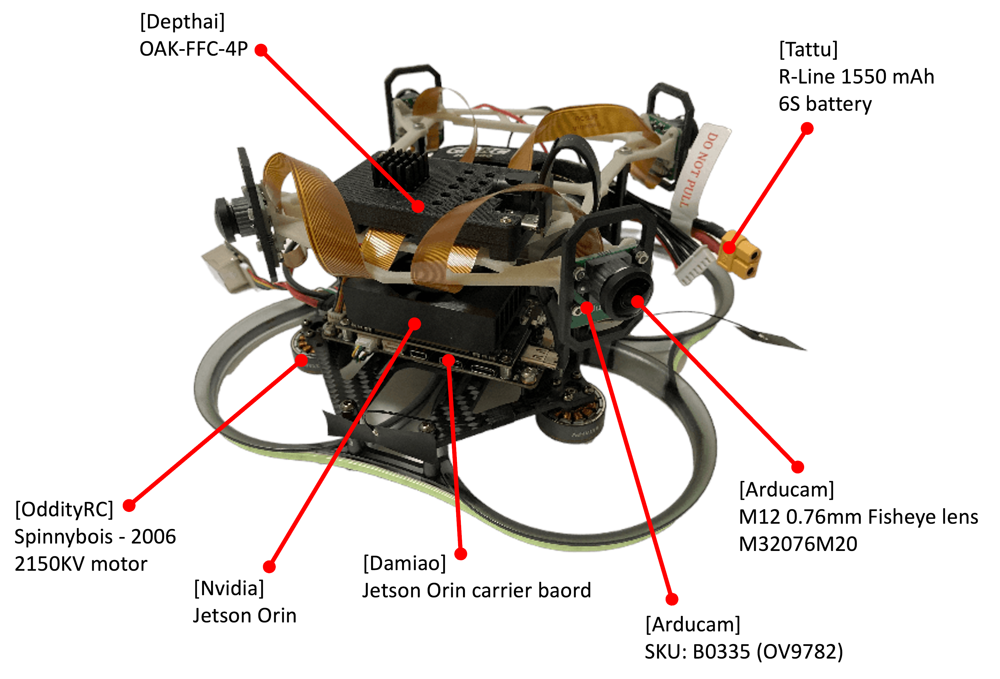

# omninxt-replica
Reproducing the OmniNxt project

## Background
This is a personal project that attempts to reproduce the opensourced [OmniNxt](https://github.com/HKUST-Aerial-Robotics/OmniNxt) project, which is released by the HKUST Aerial Robotics Group, their projects are already well documented and easy to follow through, please refer to their project for more details. Since it has been a while wanting to learn multi-camera platfrom for autonomous control system, so this repository simply serves as a learning memo along building the quadcam drone platform. However not a professional SLAM and control algorithm personnel, therefore I would not go into the detail explaining algorithms behind, since there may have some mis-understanding in the concept of the proposed algorithms, going through their [OmniNxt paper](https://arxiv.org/pdf/2403.20085) may be better way to understand.

AFAIK, the OmniNxt consists few necessary components to make the system to work.
* [**HW**] The quadcam drone platform
* [**SW**] Camera calibration pipeline
* [**SW**] The Omni-depth: a.k.a The D2SLAM, for generating surround depth information
* [**SW**] The Omni-Vins: a.k.a The D2SLAM, For self-localization
* [**SW**] Controls algorithms

## Build the OmniNxt platform

This is the multi-camera platform that all the software components are based on, therefore the choise of the each hardware parts are quite important, e.g. Camera module, camera lens, ESC, motor, flight controller. Please refer to the `Build your own OmniNxt` section for details, they already provided the information for the exact parts to use and where to get them.

The assembled platform is as follow, however during the build there are few parts still uncertained.

* Fisheye lens
    * The specification of the lens model is not provided, but it seems that the fisheye lens FOV needs to be larger than 210 degrees.
    * The [M32076M20](https://www.arducam.com/product/m32076m20-2/) Arducam lens is used, which has 220 degree FOV on 1/4” RPi Camera, however still not sure this is a suitable choice.
* Camera cable.
    * Customized cable is required for better cable management, but could not find suitable maker that could customize the cable.
    * So just used the FCC cables that came with the camera, but the cable management is a mess.
* Motors
    * Although the `2204 1750KV / 1804 2450KV` motors are the selections, but could not find the specific size and kv rating of motors.
    * End up of using the default [Spinnybois-2006 2150KV](https://oddityrc.com/products/oddityrc-stream-2006-1950kv-high-efficiency-cinematic-motor) motors from Oddity RC, it is default motor that came with the Oddity RC [XI35](https://oddityrc.com/products/xi35pro-walksnail-avatar-pro-version) frame.
* The quadcam frame
    * Not sure what material was used for the quadcam frame, which mounts the OAK-FFC-4P and the cameras.
    * As the shape of the frame is not easy to 3D print with my FDM printer due to amount of supports are required, also hard to CNC with carbon fiber plate.
    * Simply worried about the structure strength during flight. eventually end up using SLS printing to make the frame.
* Not shown in the figure
    * [NxtPX4v2](https://micoair.com/flightcontroller_nxtpx4v2/) flight controller is used.
    * [Foxeer Reaper F4 Mini 128K 4in1 BL32 60A](https://www.foxeer.com/foxeer-reaper-f4-mini-128k-4in1-bl32-60a-esc-9-40v-20-20mm-m3-g-419) ESC is used, simply it is the ESC I have in hand at the moment, and still have the defatul BLHeli 32 firmware on board.

## Camera calibration

The cameras on the OmniNxt platform need to be calibrated before using in the depth estimation and SLAM. Refer to the [README](kalibr-tools/README.md) in the `kalibr-tools` directory for how to calibrate the cameras in the platform.

## D2SLAM
