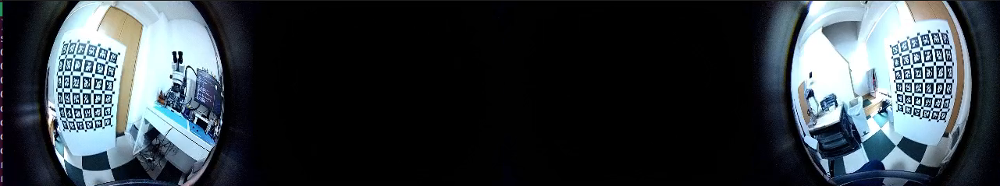
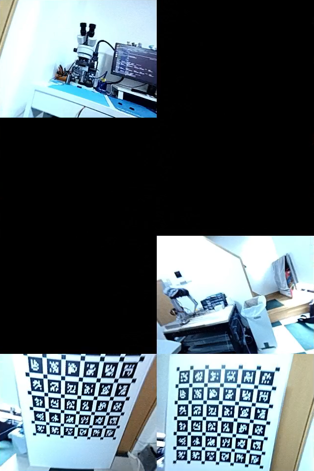

# kalibr-tools
> calibration tools for the OmniNxt quadcam platform
## Background
This is a modified variant based of [quarterKalibr](https://github.com/D2SLAM-Fusion/tools-quarterKalibr) by HKUST Aerial Robotics Group. Potentially used for personal learning purposes, in order to understand how OmniNxt quadcam platform was calibrated.

## Intro
Refactoring the [quarterKalibr](https://github.com/D2SLAM-Fusion/tools-quarterKalibr) to fit my own needs, mainly cleanup the original source code, and commenting the code along the way of learning how the quadcam platform was calibrated (not a professionall camera calibrator :)). Hope to make some notes when follow along the instructions provided by the original repository, especially few frustration moments during the calibration process and anything could be improved.

This kalibr-tools is organized in following structure.
```shell
kalibr-tools/
├── configs
│   ├── april_6x6.yaml
│   └── imu.yaml
├── data
│   └── keepme.md
├── Dockerfile.melodic
├── Dockerfile.noetic
├── hacks
│   └── IccSensors.py
├── kalibr-tools
│   ├── calibrate.py
│   ├── extract.py
│   ├── generate.py
│   └── utils
├── README.md
└── scripts
    ├── calibrate.sh
    └── extract.sh

```

## Prerequisites
Everything in this repo are only tested under the Linux ubuntu platform, other platforms were not tested.
```
NAME="Ubuntu"
VERSION_ID="22.04"
VERSION="22.04.2 LTS (Jammy Jellyfish)"
VERSION_CODENAME=jammy
```

Before starting, make sure docker is install on the host computer. This tool is purely based on docker containers, if not kindly follow the [instructions](https://docs.docker.com/engine/install/ubuntu/) to install docker. Docker version used as follows
```
Docker version 25.0.4, build 1a576c5
```

It is very straight forward to start using the calibration tools. As the original repository described you need to prepare a ROS bag file that contains specific ROS topics. Need to record the rosbag in a specific way base on the OmniNxt quadcam platform, which also described in the origin repository with [video](https://www.youtube.com/watch?v=oh9gTLWwYCM).

- In this example, recorded rosbag that contains following topics
    - image topic (/oak_ffc_4p/assemble_image/compressed)
    - imu topic (/mavros/imu/data_raw)

Once the recorded rosbag file (`.bag`) is ready, place the rosbag into the `data` folder, then continue with the next step.

## Installation

First of all, change directory to at the top of `kalibr-tools`
```shell
git clone https://github.com/nlpng/omninxt-replica.git
cd omninxt-replica/kalibr-tools
```

Build the docker container for the calibration tools, they are based on ROS (noetic and melodic) containers. This might take a while to complete. When it is done, you should see the built container using the `docker images` command.

**NOTE** At the moment of writing, the ROS Noetic docker container is not fully tested due to the [know issue](#known_issues).

- ROS Noetic

```shell
docker build -f Dockerfile.noetic -t quadcam-calib:noetic .
```

- ROS Melodic

```shell
docker build -f Dockerfile.melodic -t quadcam-calib:melodic .
```

## Setting up
Before running the calibration, the followings need to be prepare

- Place the recorded bag into the `data` directory
- Make sure the parameters in the `configurator.py` are correct w.r.t the rosbag recording
    - Named the recorded robag file as `quadcam_calib.bag`, choose other names for preference
    - If followed the instruction of rosbag recording of the original repo, `image_topic` and `imu_topic` should be identical.
    - **NOTE**: At the time of writting this, not sure about the `photometric_calibration_path` parameter, there is no instruction how to obtain the data for this parameter.


```python
photometric_calibration_path = None

virtual_fov = 180
virtual_width = 320
virtual_height = 240

image_topic = "/oak_ffc_4p/assemble_image/compressed"
imu_topic = "/mavros/imu/data_raw"

rosbag_path = "./data/quadcam_calib.bag"
output_path = "./data/extracted_output/"
```


## Running
There are `ipynb` notebook provided by the origin repo, there is no problem of using the notebook to run calibration processes one by one. Since prefer running the whole processe inside docker, therefore prepared shell scripts to run the calibration instead.

The calibration is going through the following processes as described in the original repo

>The following steps are in calibrate.ipynb, all you need is to click one by one; if failed, you can record a new bag to resume the calibration; use fix_calibration.ipynb extract the data bag for the failed process）
>1. configure your data bag path and output path
>2. extracting calibration rosbags
>3. calibrating fisheye cameras' intrinsic parameters.
>4. calibrating stereo pair cameras' extrinsic parameters.
>5. calibrating fisheye cameras & imu extrinsic parameters.
>6. generate virtual stereo input configurations(parameters from 3 4 5)
>7. calibrating virtual stereos

Navigate to the top level of the `kalibr-tools` directory.
```shell
cd /to/kalibr-tools/path
```

In step 2, before calibration, extract the rosbag into separated `.bag` file for each camera and camera pair, this will generate a `extracted_output` folder under `data` to store all the calibration files

```shell
# [Optional] Make sure the file is executable
chmod +x ./scripts/extract.sh

# Run the script
./scripts/extract.sh
```

After extration, the `extracted_output` folder should contain the following files that will be used to proceed to the calibration.

```shell
extracted_output/
├── april_6x6.yaml
├── CAM_A.bag
├── CAM_A-CAM_B.bag
├── CAM_B.bag
├── CAM_B-CAM_C.bag
├── CAM_C.bag
├── CAM_C-CAM_D.bag
├── CAM_D.bag
├── CAM_D-CAM_A.bag
├── stereo_depth_calibration.bag
```

For steps 3 to 7, execute the following command

```shell
# [Optional] Make sure the file is executable
chmod +x ./scripts/calibrate.sh

# Run the script
./scripts/calibrate.sh
```

Finally if everything went well, all the calibrated parameters and information are saved in the `extracted_output` folder under the `data` directory.


<a name="known_issues"></a>
## Known issues
Lists of errors occured during the Calibration processes

### mono/stereo calibration
During the processes of mono or stereo calibration, many rosbags are attempted, most possibly ran into the `DLT algorithm needs at least 6 points for pose estimation from 3D-2D point correspondences` error.

```
Extracting calibration target corners
  Extracted corners for 683 images (of 1916 images)
Traceback (most recent call last):
  File "/catkin_ws/devel/lib/kalibr/kalibr_calibrate_cameras", line 15, in <module>
    exec(compile(fh.read(), python_script, 'exec'), context)
  File "/catkin_ws/src/kalibr/aslam_offline_calibration/kalibr/python/kalibr_calibrate_cameras", line 450, in <module>
    main()
  File "/catkin_ws/src/kalibr/aslam_offline_calibration/kalibr/python/kalibr_calibrate_cameras", line 187, in main
    if not cam.initGeometryFromObservations(observations):
  File "/catkin_ws/src/kalibr/aslam_offline_calibration/kalibr/python/kalibr_camera_calibration/CameraCalibrator.py", line 57, in initGeometryFromObservations
    success = self.geometry.initializeIntrinsics(observations)
RuntimeError: OpenCV(4.2.0) ../modules/calib3d/src/calibration.cpp:1171: error: (-2:Unspecified error) in function 'void cvFindExtrinsicCameraParams2(const CvMat*, const CvMat*, const CvMat*, const CvMat*, CvMat*, CvMat*, int)'
> DLT algorithm needs at least 6 points for pose estimation from 3D-2D point correspondences. (expected: 'count >= 6'), where
>     'count' is 5
> must be greater than or equal to
>     '6' is 6
```
There are [issues](https://github.com/ethz-asl/kalibr/issues/555) described about this error, but seems no proper fix yet. After many attempts, some recorded rosbags works some are not when using ROS `noetic` (based on Ubuntu 20.04).

The **solution** at the moment is using the ROS `Melodic` (Ubuntu 18.04), since the error does not happen on the Ubuntu 18.04. Probably cuased by the Opencv version of the Ubuntu version.

### mono-imu calibration
During the imu calibration, ran into the following error for both ROS noetic and melodic dockers.
```
Adding accelerometer error terms (/mavros/imu/data_raw)
Traceback (most recent call last):
  File "/root/catkin_ws/src/tartancalib/aslam_offline_calibration/kalibr/python/kalibr_calibrate_imu_camera", line 246, in <module>
    main()
  File "/root/catkin_ws/src/tartancalib/aslam_offline_calibration/kalibr/python/kalibr_calibrate_imu_camera", line 200, in main
    verbose = parsed.verbose)
  File "/root/catkin_ws/src/tartancalib/aslam_offline_calibration/kalibr/python/kalibr_imu_camera_calibration/IccCalibrator.py", line 136, in buildProblem
    imu.addAccelerometerErrorTerms(problem, self.poseDv, self.gravityExpression, mSigma=huberAccel, accelNoiseScale=accelNoiseScale)
  File "/root/catkin_ws/src/tartancalib/aslam_offline_calibration/kalibr/python/kalibr_imu_camera_calibration/IccSensors.py", line 686, in addAccelerometerErrorTerms
    mest = aopt.NoMEstimator()
Boost.Python.ArgumentError: Python argument types in
    NoMEstimator.__init__(NoMEstimator)
did not match C++ signature:
    __init__(_object*, double)
Error occurred while running the script: Command 'CAM_A' returned non-zero exit status 1
```

There is no record about this error, is it just me running into the error somehow. It is caused by the initialize of the `NoMEstimator`, which expect a `double` value, but the `kalibr_imu_camera_calibration` seems provide nothing to the initialization. In the c++ implementation, if nothing is provided, the `NoMEstimator` should be initialized with a default value `1.0`. Anyway by modify the `IccSensors.py` could potentially fix the errors, but no guarantee it is the correct value.

The fixed `IccSensors.py` is provided in the `hacks` folder, which will be later copied into docker for building the kalibr tools.

## Outputs

Despite the correctness of the calibrated parameters, the following files are generated in the `extracted_ouptut` folder at the end.

```
extracted_output
├── CAM_A
│   ├── log0-camchain.yaml
│   ├── log0-results-cam.txt
│   ├── log1-camchain.yaml
│   ├── log1-report-cam.pdf
│   ├── log1-results-cam.txt
│   └── log.pkl
├── CAM_A.bag
├── CAM_A-CAM_B
│   ├── intrinsic.yaml
│   ├── log0-camchain.yaml
│   ├── log0-results-cam.txt
│   ├── log1-camchain.yaml
│   ├── log1-report-cam.pdf
│   ├── log1-results-cam.txt
│   └── log.pkl
├── CAM_A-CAM_B.bag
├── CAM_A-camchain-imucam.yaml
├── CAM_A-imu.yaml
├── CAM_A-report-imucam.pdf
├── CAM_A-results-imucam.txt
├── CAM_B
│   ├── log0-camchain.yaml
│   ├── log0-results-cam.txt
│   ├── log1-camchain.yaml
│   ├── log1-report-cam.pdf
│   ├── log1-results-cam.txt
│   └── log.pkl
├── CAM_B.bag
├── CAM_B-CAM_C
│   ├── intrinsic.yaml
│   ├── log0-camchain.yaml
│   ├── log0-results-cam.txt
│   ├── log1-camchain.yaml
│   ├── log1-report-cam.pdf
│   ├── log1-results-cam.txt
│   └── log.pkl
├── CAM_B-CAM_C.bag
├── CAM_B-camchain-imucam.yaml
├── CAM_B-imu.yaml
├── CAM_B-report-imucam.pdf
├── CAM_B-results-imucam.txt
├── CAM_C
│   ├── log0-camchain.yaml
│   ├── log0-results-cam.txt
│   ├── log1-camchain.yaml
│   ├── log1-report-cam.pdf
│   ├── log1-results-cam.txt
│   └── log.pkl
├── CAM_C.bag
├── CAM_C-camchain-imucam.yaml
├── CAM_C-CAM_D
│   ├── intrinsic.yaml
│   ├── log0-camchain.yaml
│   ├── log0-results-cam.txt
│   ├── log1-camchain.yaml
│   ├── log1-report-cam.pdf
│   ├── log1-results-cam.txt
│   └── log.pkl
├── CAM_C-CAM_D.bag
├── CAM_C-imu.yaml
├── CAM_C-report-imucam.pdf
├── CAM_C-results-imucam.txt
├── CAM_D
│   ├── log0-camchain.yaml
│   ├── log0-results-cam.txt
│   ├── log1-camchain.yaml
│   ├── log1-report-cam.pdf
│   ├── log1-results-cam.txt
│   └── log.pkl
├── CAM_D.bag
├── CAM_D-CAM_A
│   ├── intrinsic.yaml
│   ├── log0-camchain.yaml
│   ├── log0-results-cam.txt
│   ├── log1-camchain.yaml
│   ├── log1-report-cam.pdf
│   ├── log1-results-cam.txt
│   └── log.pkl
├── CAM_D-CAM_A.bag
├── CAM_D-camchain-imucam.yaml
├── CAM_D-imu.yaml
├── CAM_D-report-imucam.pdf
├── CAM_D-results-imucam.txt
├── fisheye_cams.yaml
├── quadcam_vig_mask
│   ├── avg23_mask.png
│   ├── cam_0_vig_mask.png
│   ├── cam_1_vig_mask.png
│   ├── cam_2_vig_mask.png
│   └── cam_3_vig_mask.png
├── stereo_depth_calibration.bag
└── virtual_stereo_calibration_180
    ├── stereo_calib_0_1_240_320-camchain.yaml
    ├── stereo_calib_0_1_240_320-report-cam.pdf
    ├── stereo_calib_0_1_240_320-results-cam.txt
    ├── stereo_calib_0_1_240_320.sh
    ├── stereo_calib_1_2_240_320-camchain.yaml
    ├── stereo_calib_1_2_240_320-report-cam.pdf
    ├── stereo_calib_1_2_240_320-results-cam.txt
    ├── stereo_calib_1_2_240_320.sh
    ├── stereo_calib_2_3_240_320-camchain.yaml
    ├── stereo_calib_2_3_240_320-report-cam.pdf
    ├── stereo_calib_2_3_240_320-results-cam.txt
    ├── stereo_calib_2_3_240_320.sh
    ├── stereo_calib_3_0_240_320-camchain.yaml
    ├── stereo_calib_3_0_240_320-report-cam.pdf
    ├── stereo_calib_3_0_240_320-results-cam.txt
    ├── stereo_calib_3_0_240_320.sh
    └── stereo_calibration_step_1_width_320_height_240.bag

```

### Captured frames
By turning on the `verbo` option in the `calibrate_virtual_stereo` method from the `calibrate.py`, the image used to generate `stereo_calibration_step_1_width_320_height_240.bag` file could be observed, as well as the sensor images captured from the OmniNxt quadcam platform, like the following samples.

* Fisheye camera pair A-D with corresponding virtual stereo image



* The corresponding virtual stereo images


